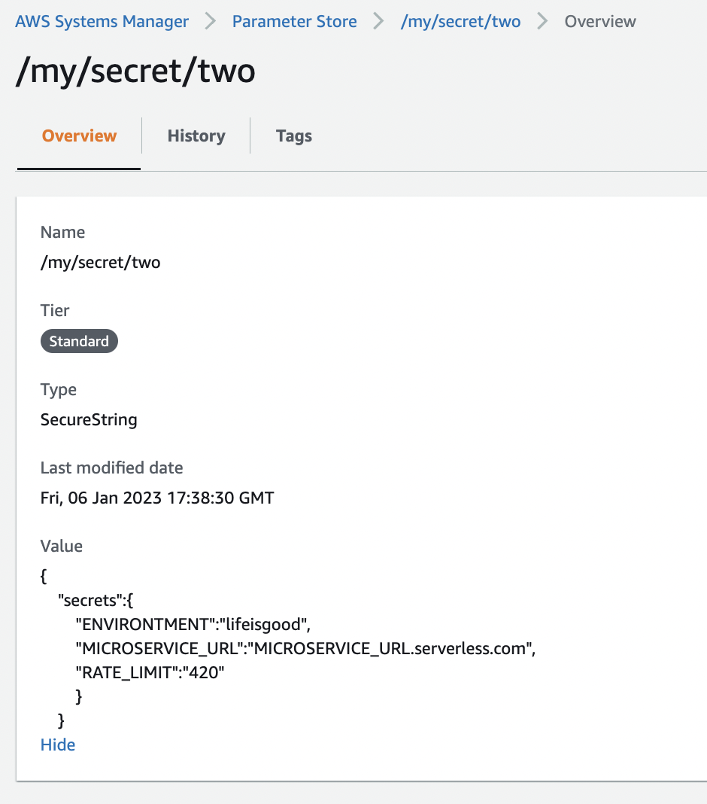
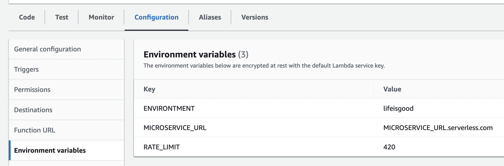

# Serverless Remote JSON Envs
eso
This Serverless Framework Plugin allows to use plain JSON files in remote locations being parsed as environment variables in lambda, this unlocks ability to do integrations with anothers services and/or SSM ParameterStore to save many environment variables in a single parameters key as a JSON.

## Install

Run `serverless plugin install` in your Serverless project.

```bash
serverless plugin install -n serverless-remote-json-envs
```

## Supported AWS services

- SSM ParameterStore
- S3

## Usage

Define YAML configuration within custom block as:

SSM
```YAML
[...]
[...]
custom:
  RemoteJSONEnvs:
    provider:
      aws:
        SSMParameterStore:
          - key: /my/secret/one
            secretJSONKey: 'secretos'
          - key: /my/secret/two
            secretJSONKey: 'secrets'
          - key: /my/secret/three
            secretJSONKey: 'secrets'
[...]
[...]
```

S3
```YAML
[...]
[...]
custom:
  RemoteJSONEnvs:
    provider:
      aws:
        S3:
          - key: mybucketname/myenvsfile.json
            secretJSONKey: 'secretos'

[...]
[...]
```
You can add as many keys as you need


secretJSONKey: is the root JSON key where you secrets are stored inside your JSON file
E.G:
```JSON
{
    "secrets":{
        "ENVIRONTMENT":"lifeisgood",
        "MICROSERVICE_URL":"MICROSERVICE_URL.serverless.com",
        "RATE_LIMIT":"420"
        }
    }
```



Lambda envs will end up like this:


